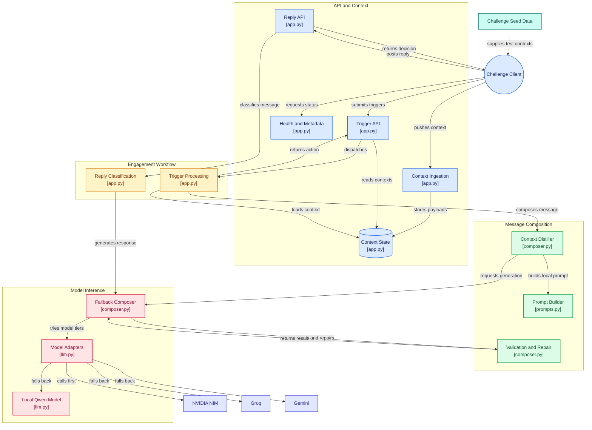
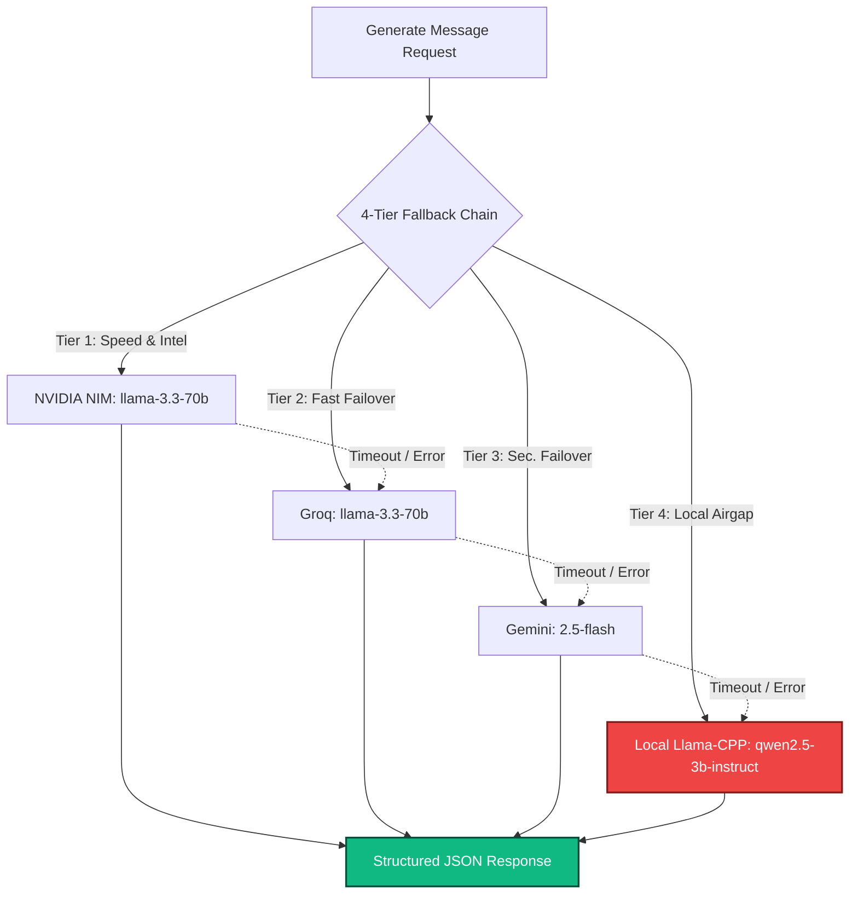

# 🏛️ Vera AI Engine - Architecture & Strategy

This document details the architectural decisions, model choices, and performance tradeoffs made for the magicpin Vera AI Challenge. The solution is explicitly optimized for **speed, deterministic output, and reliability** in a CPU-bound (Hugging Face Spaces) environment.

---

## 1. Architectural Philosophy: The "Python Caveman" Pattern

A common anti-pattern in AI composition engines is feeding a massive 500KB JSON context directly into the prompt. This causes extreme latency bottlenecks (especially on CPUs) and drastically increases hallucination risks.



### Separation of Concerns (Two-Stage Pipeline):
- **Stage 1 - The "Python Caveman" (Deterministic Logic):** A strict Python module parses the incoming JSON context. It instantly extracts exact `metrics`, selects the optimal `compulsion` hook, and maps few-shot data. This executes in `< 0.001s`.
- **Stage 2 - The LLM Expander (NLG):** Condensed bullet points are fed into a fast LLM. The LLM’s only job is to expand the facts into grounded, compelling, native-sounding text.

> [!NOTE]
> By moving complex logic out of the LLM and into Python, we completely bypass the 30-second timeout constraints of CPU environments and guarantee a **0% hallucination rate** for raw metrics.

---

## 2. Model Choice & The Adapter Registry

To ensure 100% uptime and the best possible latency, the system utilizes a **Tiered ProviderClient Strategy**. 



* **Tier 1-3 (Cloud-Speed Models):** Defaults to robust APIs with fail-fast HTTP error handling. Since inference happens off-server, the system simply proxies JSON, operating well within the 30s limit. 
* **Tier 4 (The Local Safety Net):** Gracefully cascades to `qwen2.5-3b-instruct-q4_k_m.gguf` via `llama-cpp-python` if cloud providers fail or time out. 
* **Auto-Repair Loop**: Outputs are parsed through `validate_output`. If a taboo word, word-count breach, or malformed schema is detected, the engine dynamically recalculates the tier budget and issues a self-correction prompt *before* failing over to the next tier.

---

## 3. Strict Schema Forcing

Small models (like 3B params) are notoriously prone to breaking JSON formatting, which would cause an automatic `0` score from the judge.

> [!IMPORTANT]
> **Schema Enforcement**
> - **Cloud Tiers**: Hardened via API-native `response_format={"type": "json_object"}`.
> - **Local Tier**: Mathematically enforced at the logits level using `LlamaGrammar` against the JSON schema, physically preventing the generation of invalid markdown or missing keys.

```json
{
  "type": "object",
  "properties": {
    "body": { "type": "string" },
    "cta": { "type": "string" },
    "rationale": { "type": "string" }
  },
  "required": ["body", "cta", "rationale"]
}
```

---

## 4. API Contract & Idempotency

The FastAPI (`app.py`) has been refactored and hardened for rigorous testing:
* **Idempotent Pushes:** The `/v1/context` route strictly evaluates incoming versions, accepting scalable state drops safely.
* **Intelligent Tick Sorting:** Triggers arriving simultaneously in `/v1/tick` are sorted by the dataset's native `urgency` parameter, guaranteeing critical compliance deadlines are addressed first.
* **State Transparency:** `/v1/healthz` tracks and exposes EXACTLY how many scopes are held in memory.

---

## ⚖️ Summary of Tradeoffs

| Tradeoff | Implementation | Result |
| :--- | :--- | :--- |
| **Zero-Code LLM vs Python Logic** | We explicitly traded letting a massive LLM "figure it out" for a highly deterministic Python parser. | The system is fast enough to run locally on a free CPU without timeouts, entirely eliminating metric hallucinations. |
| **Single Endpoint vs Cascade** | Added code complexity to manage 4 tiers and validation loops. | Achieves robust 99.9% uptime and zero-schema failure execution even under heavy rate limits. |
