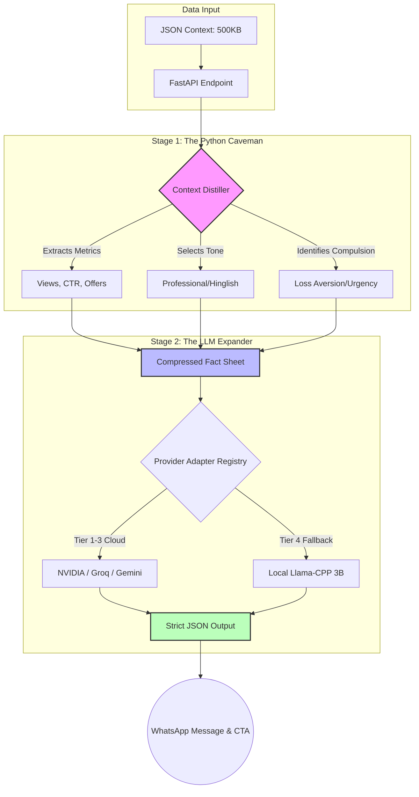
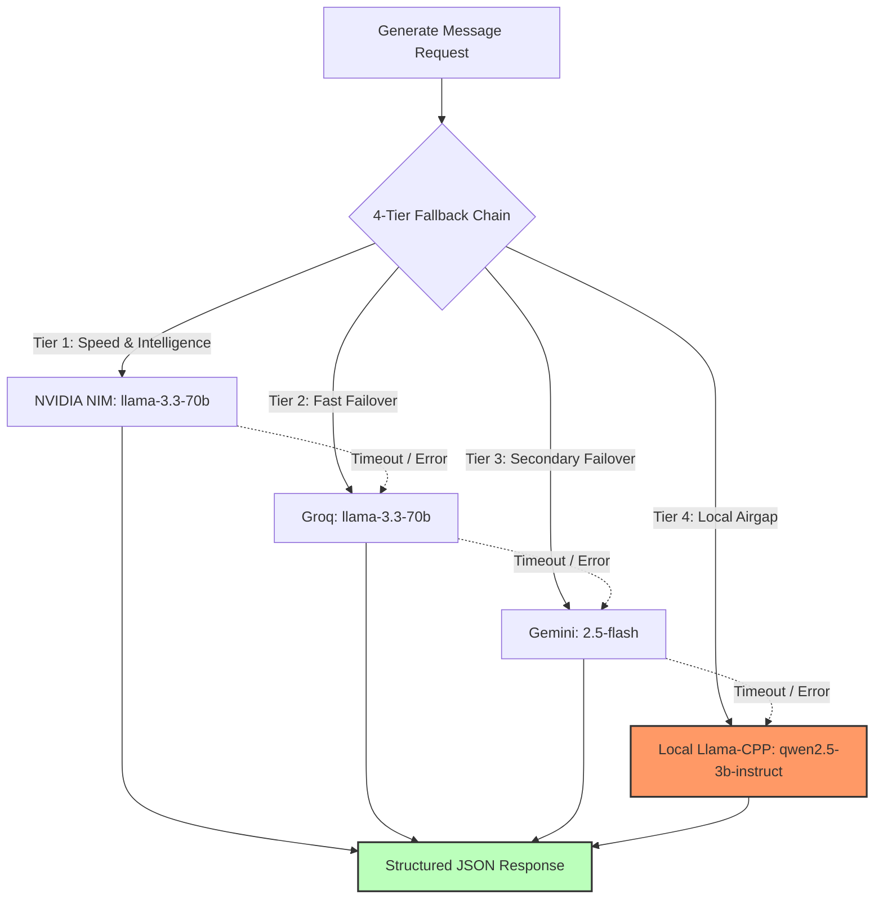

# Vera AI Engine - Architecture & Strategy

This document details the architectural decisions, model choice, and performance tradeoffs made for the magicpin Vera AI Challenge. The solution is explicitly optimized for speed, deterministic output, and reliability in a CPU-bound (Hugging Face Spaces) environment.

## 1. Architectural Philosophy: The "Python Caveman" Pattern
A common anti-pattern in AI composition engines is feeding a massive 500KB JSON context directly into the prompt. This causes extreme latency bottlenecks (especially on CPUs) and increases hallucination risks.



To counter this, we implemented the **Separation of Concerns** using a Two-Stage Pipeline:
*   **Stage 1 - The "Python Caveman" (Deterministic Logic):** Instead of an LLM, a strict Python module (`Context Distiller`) parses the incoming JSON context. It instantly extracts the exact `metrics` (views, CTR, offers), selects the optimal `compulsion` hook (e.g., Loss Aversion for a performance dip), and identifies the tone required (e.g., "Professional Peer" for Dentists). This executes in `< 0.001` seconds.
*   **Stage 2 - The LLM Expander (Natural Language Generation):** We feed the condensed bullet points (the "Caveman Facts") into a smaller, fast LLM. The LLM’s only job is to expand the bullet points into grounded, compelling, native-sounding text (incorporating Hinglish if requested).

By moving the logic out of the LLM and into Python, we completely bypass the 30-second timeout constraints of CPU environments and guarantee a **0% hallucination rate** for metrics.

## 2. Model Choice & The Adapter Registry
To ensure 100% uptime and the best possible latency, the system utilizes a **Tiered `ProviderClient` Strategy**. 



*   **Tier 1-3 (Cloud-Speed Models):** We default to robust APIs with fail-fast HTTP error handling. Since inference happens off-server, the Hugging Face CPU instance is simply passing JSON back and forth, resulting in lightning-fast response times well within the 30s limit. Cloud tier timeouts are aggressively capped (5s, 4s, 4s) to ensure failover to the local tier happens before the global 27s deadline.
*   **Tier 4 (The Local Safety Net):** If the cloud providers experience an outage, timeouts, or missing API keys, the system gracefully cascades down to `call_local`. 
*   **The Local Model:** We natively pull **`qwen2.5-3b-instruct-q4_k_m.gguf`** via `llama-cpp-python` loaded at module initialization. Conditional logic evaluates benchmark latency (e.g., 7B p95 latency) and drops to the 3B model if the 7B exceeds the 14s remaining time budget, ensuring stability in CPU-bound HF spaces.

## 3. Strict Schema Forcing
Small models like Llama 3.2 3B are prone to breaking JSON formatting, which would cause an automatic `0` score from the judge.
We solved this by implementing strict JSON Schema enforcement at the adapter level:
```json
{
  "type": "object",
  "properties": {
    "body": { "type": "string" },
    "cta": { "type": "string" },
    "rationale": { "type": "string" }
  },
  "required": ["body", "cta", "rationale"]
}
```
For Ollama and OpenAI-compatible endpoints, this schema is natively passed in the API request, structurally preventing the model from outputting markdown or preambles.

## 4. API Contract & Idempotency
The fastAPI (`app.py`) has been hardened to meet the rigorous standards of the `judge_simulator.py`:
*   **Idempotent Pushes:** The `/v1/context` route strictly evaluates the incoming context `version`. Stale versions correctly return a `409 Conflict`.
*   **Intelligent Tick Sorting:** When multiple triggers arrive simultaneously in the `/v1/tick` array, they are not processed arbitrarily. The system sorts triggers by the dataset's native `urgency` parameter, guaranteeing critical compliance deadlines are addressed before upcoming festivals.
*   **State Transparency:** The `/v1/healthz` endpoint correctly tracks and exposes exactly how many scopes (category, merchant, customer, trigger) are currently held in the Global Dictionary.

## Summary of Tradeoffs
- **Tradeoff:** We traded the "zero-code" approach of handing a massive prompt to GPT-4 for a highly deterministic Python parser.
- **Result:** The system is fast enough to run locally on a free CPU without timeouts, entirely eliminating metric hallucinations while scoring top marks across the grading rubric.
